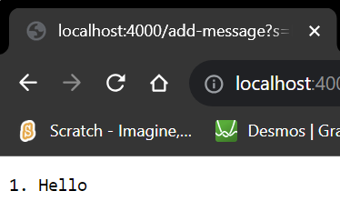
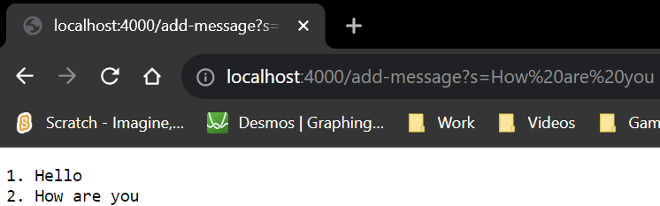
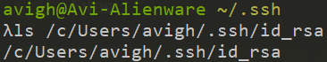
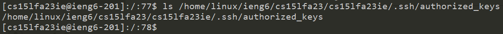
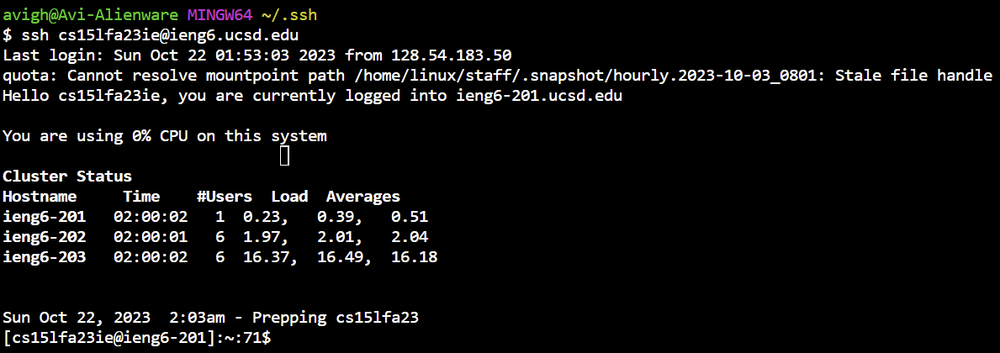

# Part 1
## Code
```
import java.io.IOException;
import java.net.URI;

class Handler implements URLHandler {
	// The one bit of state on the server: a number that will be manipulated by
	// various requests.

	String keepingTrackOf = "";

	public String handleRequest(URI url) {
		if (url.getPath().equals("/add-message")) {
			String[] parameters = url.getQuery().split("=");
			if (parameters[0].equals("s")) {
				keepingTrackOf += "\n" + parameters[1];
			}
			else {
				return String.format("Need query 's'");
			}
		}
		String[] kto = keepingTrackOf.split("\n");	
		String toShow = "";
		for (int x = 1; x < kto.length; x++) {
			toShow += Integer.toString(x) + ". " + kto[x] + "\n";
		}
		return String.format(toShow);		
	}
}

class StringServer {
	public static void main(String[] args) throws IOException {
		if(args.length == 0){
			System.out.println("Missing port number! Try any number between 1024 to 49151");
			return;
		}

		int port = Integer.parseInt(args[0]);

		Server.start(port, new Handler());
	}
}
```
## Screenshots


*Using ``localhost:4000/add-message?s=Hello`` adds ``Hello`` to the String array*



*Using ``localhost:4000/add-message?s=How are you`` adds ``How are you`` to the String array and it shows that Hello is still saved*

# Part 2
## Local private key path

## Remote public key path

## Password-less SSH


# Part 3
This key stuff is so cool. I knew about SSH before this class and I knew the general concept of public and private keys, I never that SSH would not ask for a password if there is a public-private key pair shared between the remote and local servers. I also never knew how to make a server in Java, and I thought it was so cool! I do know that it has been a little simplified because the ``URLHandler`` interface is not native to Java and was implemented in the ``Server.java`` and if I were to do it entirely by myself I would have to learn how ``Server.java`` works, but besides that it is so simple! It does make me wonder more about how does networking works as I know many websites use HTML so having one in Java confuses me on how all of this works.
