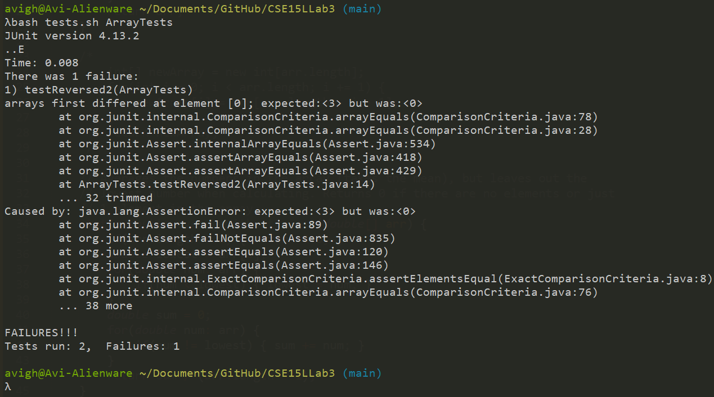

# Part 1 - Bugs
## A failure-inducing input for the buggy program
```
	@Test
	public void testReversed2() {
		int[] input1 = {1, 2, 3};
		assertArrayEquals(new int[]{3, 2, 1}, ArrayExamples.reversed(input1));
	}
```
## An input that doesn’t induce a failure
```
	@Test
	public void testReversed() {
		int[] input1 = { };
		assertArrayEquals(new int[]{ }, ArrayExamples.reversed(input1));
	}
```
## The symptom



## The bug
### Before
```
	static int[] reversed(int[] arr) {
		int[] newArray = new int[arr.length];
		for(int i = 0; i < arr.length; i += 1) {
			arr[i] = newArray[arr.length - i - 1];
		}
		return arr;
	}
```
### After
```
	static int[] reversed(int[] arr) {
		int[] newArray = new int[arr.length];
		for(int i = 0; i < arr.length; i += 1) {
			newArray[i] = arr[arr.length - i - 1];
		}
		return newArray;
	}
```

The symptom shows that the array for some reason sets the first element to 0, which is an element that is not in the given array. The error is that the original code edits ``arr`` with the values of ``newArray`` instead of the reverse, and it also returns ``arr`` which is incorrect as its supposed to return a new array. This explains the first element being 0 as a new integer arrays are filled with all zeros.

# Part 2 - Researching Commands (grep)
