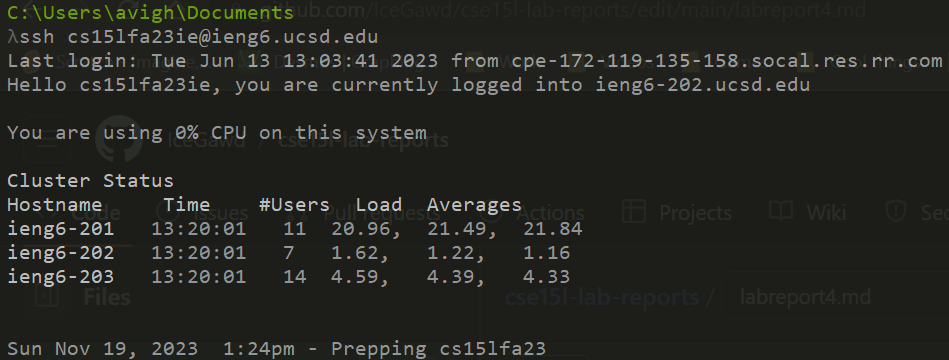
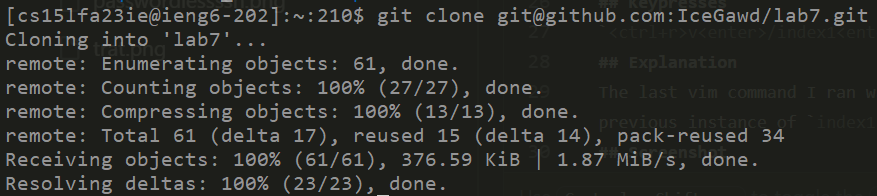
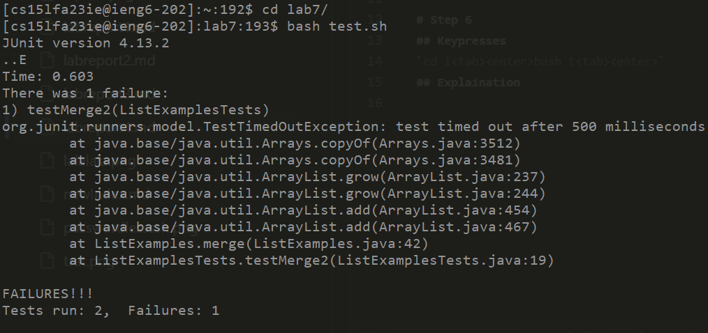
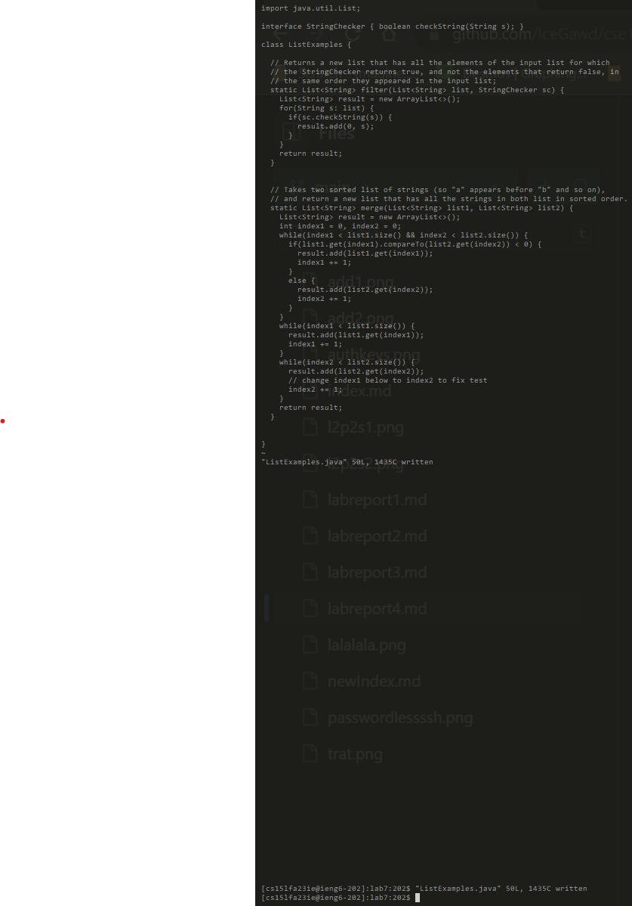
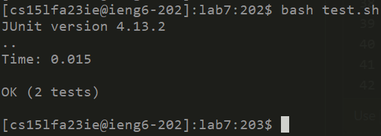
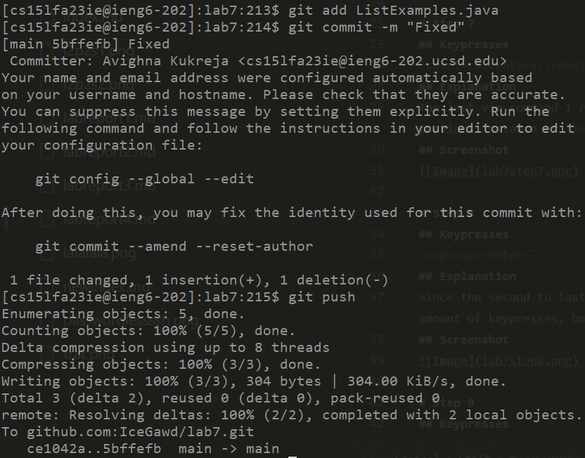

# Step 4
## Keypresses
`<up><enter>`
## Explanation
The last command run locally was the SSH, so doing up and enter will give me access. Since we set up passwordless SSH, I don't even have to type a password.
## Screenshot

# Step 5
## Keypresses
`<ctrl+v><enter>`
## Explanation
In my current clipboard, I have saved the command `git clone git@github.com:IceGawd/lab7.git`, so pasting it and then running it is all that is needed.
## Screenshot

# Step 6
## Keypresses
`cd l<tab><enter><ctrl+r>b<enter>`
## Explanation
The lab7 directory is the only directory in home that has an 'l' as the starting character so we can tab autofill. I couldn't use `<ctrl+r>c<enter>` for `cd lab7/` because my previous `cd` statement was actually `cd ..`, but since the only command I use that starts with `b` is `bash test.sh`, we can use `<ctrl+r>`.
## Screenshot

# Step 7
## Keypresses
`<ctrl+r>v<enter>/index1<enter>Nexi2<escape>:wq`
## Explanation
The last vim command I ran was `vim ListExamples.java` so we can just reverse search that. We do `/index1` to search for every instance of the string `index1`. We then do `N` to go to a previous instance of `index1`, which wraps around to the end of the file which is where we need to be. `e` will move the cursor to the end of the word, except the last character, `x` will delete the next character, which in this case happens to be `1`. Now that it has become `index` we type `2` to make it `index`. We then simply go back to normal mode with `<escape>`, use `:` to indicate we are going to run something, type `w` to write, `q` to quit and we are back to the terminal. 
## Screenshot

# Step 8
## Keypresses
`<up><up><enter>`
## Explanation
Since the second to last command we ran was `bash test.sh`, we can go up two in history and run it. Alternatively we could have done `<ctrl+r>b<enter>` like in Step 6, which is an equal amount of keypresses, but I personally find up twice is faster than holding control then pressing r.
## Screenshot

# Step 9
## Keypresses
`<ctrl+r>git a<enter><ctrl+r>git co<enter><ctrl+r>git p<enter>`
## Explanation
The last git command with `a` was `git add ListExamples.java`. We can't do `git c` as that would give us `git clone` so we do `git co` to get `git commit -m "Fixed"`. Finally, we tab autocomplete `git p` to `git push` to finish it.
## Screenshot

