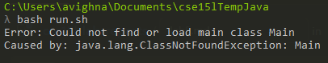

# Part 1
## Original Post

I compile my java file but it isn't running. I am trying to make a bash file that cleanly deals with all of the class files that javac makes but it isn't working. I don't really know what the issue is, as I remove the class files after I run java. Here is a screenshot


## TA Response

This could only be happening if the class file doesn't exist. This could mean either it is not in the current directory or it got deleted or it never compiled to begin with. Did you run your bash file with ``set -e``? In what order and what actions does your bash file exactly do? Send screenshots of code if possible

## Student Response

Here is the code for both Main.java and run.sh


There is no ``set -e`` in the bash file because even if the code doesn't compile, I want to delete the folder I create so that ``mkdir`` doesn't have a problem the next time I run the bash file. The bash file compiles, moves, runs, deletes in that order.

## Solution
The file structure is quite simple (*NOTE files marked with an asterisk mean that they get created, destroyed or moved during the runtime of run.sh

```
C:\Users\avighna\Documents\cse15lTempJava
- Main.java
- run.sh
- Main.class*
- classFiles\*
- - Main.class*
```

Besides the deletion and creation of files, no files are modified during the runtime of ``run.sh``.

Simply running ``bash run.sh`` causes the issue. The real issue is the ``java Main`` command inside of ``run.sh``.

Moving the class files before running the code is the main issue here. Files are only searched for in certain areas, so moving the class file to the other folder causes the ``java`` command to not find the class files. To fix this, the code should move into the new directory before trying to run ``java``. However, in addition to this, you need to also remove the ``cd classFiles`` as you are doing it earlier. Here is the modified ``run.sh``

```
javac *.java

mkdir classFiles
mv *.class classFiles
cd classFiles

java Main

rm *.class
cd ..
rmdir classFiles
```
